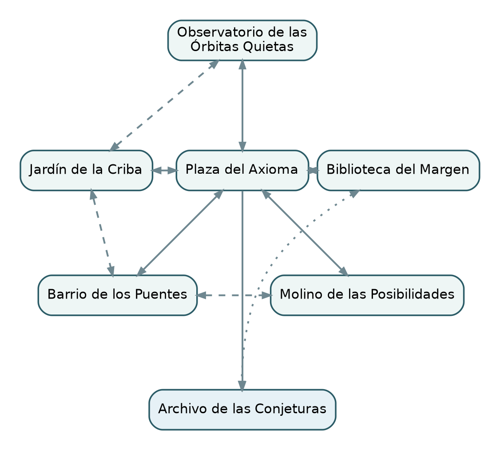
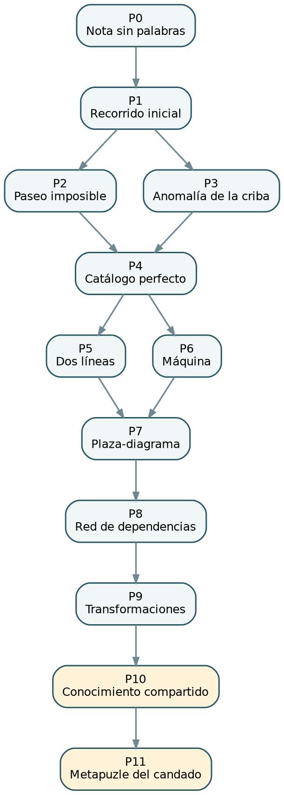
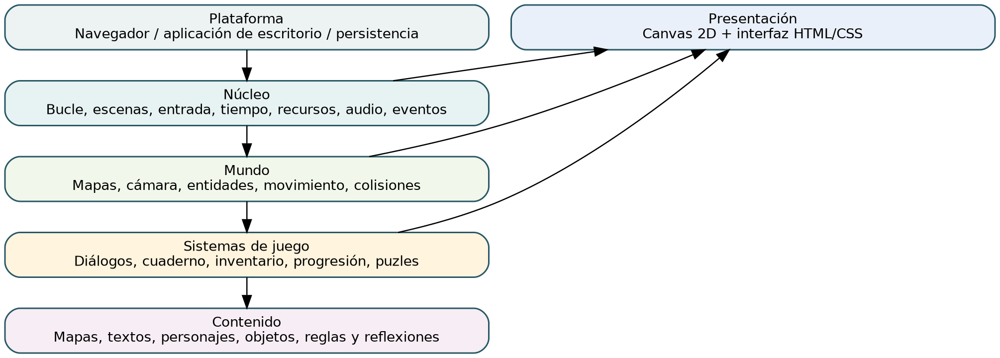
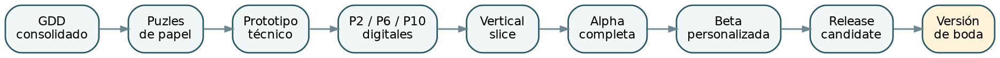

# Control del documento

| Campo | Valor |
|---|---|
| Proyecto | El Teorema del Sí |
| Tipo | Game Design Document y Technical Design Overview |
| Versión | 0.1 |
| Estado | Diseño base aprobado provisionalmente |
| Fecha | 24 de julio de 2026 |
| Plataforma objetivo | Windows, tecnología web empaquetada |
| Fuente mantenible | Markdown en el repositorio |
| Exportación | Microsoft Word |

> Este documento es la especificación funcional del primer diseño. Las decisiones marcadas como provisionales deben validarse mediante prototipos antes de convertirse en producción definitiva.

# Resumen ejecutivo

El Teorema del Sí es una aventura narrativa de puzles matemáticos en pixel art creada como regalo de boda. El protagonista investiga la desaparición de la novia en el pueblo de Axioma, descubre un archivo matemático oculto y se enfrenta a un autómata que exige una certeza imposible sobre el futuro de la pareja.

El juego evita combate, penalizaciones y dificultad artificial. La aventura principal es accesible y variada; los dos últimos acertijos concentran el desafío de nivel experto. El desenlace no muestra una recompensa digital: permite deducir la combinación de un candado real.

El diseño está preparado para un proyecto indie de alcance controlado. La implementación prevista utiliza Canvas 2D, HTML, CSS y JavaScript. Antes de producir el juego completo se validarán tres puzles de alto riesgo y un vertical slice del prólogo.

# Índice de capítulos

| Capítulo | Alcance |
|---|---|
| 1. Concepto general | Visión, público, pilares, alcance y filosofía de dificultad |
| 2. Historia | Premisa, actos, antagonista, agencia de la novia y resolución |
| 3. Mundo | Axioma, localizaciones, evolución y conexiones temáticas |
| 4. Personajes | Reparto, motivaciones, voz, relaciones y personalización |
| 5. Mapa | Distribución, estados de progresión, barreras y atajos |
| 6. Mecánicas | Controles, cuaderno, inventario, guardado y accesibilidad |
| 7. Puzles | Cadena completa, soluciones, reflexiones y validación |
| 8. Dirección artística | Pixel art, paleta, sprites, animaciones e interfaz visual |
| 9. Interfaz y UX | Pantallas, foco, paneles, tutorial y mensajes |
| 10. Diseño técnico | Arquitectura, datos, estados, persistencia y distribución |
| 11. Producción | Hitos, pruebas, candado, entrega y contingencias |
| 12. Apéndices | Riesgos, decisiones pendientes, recursos y glosario |

# 1. Concepto general

## 1.1. Visión

**El Teorema del Sí** es una aventura narrativa de puzles matemáticos en pixel art creada como regalo de boda. El jugador controla a un protagonista inspirado en el novio y recorre un pequeño mundo ficticio para investigar la desaparición de la novia. La aventura culmina en la deducción de una combinación numérica que abre un candado físico.

El juego no debe sentirse como una colección de ejercicios. Las matemáticas forman parte de los lugares, los personajes, los mecanismos y la historia. La experiencia persigue diversión, misterio, humor y satisfacción intelectual, con un cierre emocional contenido.

## 1.2. High concept

> Una aventura gráfica de estilo 16 bits en la que un matemático explora un pueblo lleno de personajes excéntricos, secretos y acertijos elegantes para rescatar a su pareja y descubrir una combinación oculta fuera del propio videojuego.

## 1.3. Género y formato

- Aventura narrativa cenital.
- Exploración, conversación e investigación.
- Puzles de lógica y matemáticas.
- Sin combate, salud, experiencia ni economía.
- Sin presión de tiempo ni pérdida significativa de progreso.
- Partidas de una o varias sesiones.
- Duración de la aventura principal: aproximadamente entre 90 y 120 minutos para un jugador muy hábil.
- Los últimos acertijos pueden prolongarse durante días.

## 1.4. Público

El jugador principal es una única persona: el novio. Se presupone comodidad con el razonamiento abstracto y gusto por los acertijos. La experiencia también debe ser entretenida para la novia, familiares o amigos que observen o colaboren.

## 1.5. Experiencia deseada

La experiencia debe provocar, por orden de prioridad:

1. Diversión y risas.
2. Curiosidad y deseo de explorar.
3. Satisfacción al comprender soluciones elegantes.
4. Sorpresa al conectar información lejana.
5. Reconocimiento del esfuerzo y la personalización del regalo.
6. Emoción final sin sentimentalismo excesivo.

## 1.6. Pilares de diseño

### Puzles elegantes

Cada acertijo debe tener una idea central identificable. La solución debe producir la sensación de que, una vez comprendida, era inevitable. La dificultad procede de encontrar la representación correcta, no de efectuar cálculos largos.

### Matemáticas integradas

Los conceptos aparecen mediante arquitectura, rutas, testimonios, libros, máquinas, plantas, símbolos y comportamiento de personajes. No habrá una sucesión de preguntas aisladas.

### Exploración significativa

Cada desplazamiento debe descubrir una pista, un personaje, una relación o un cambio del mundo. No habrá grandes áreas vacías diseñadas para inflar la duración.

### Humor con personalidad

El humor nace de personajes obsesivos, burocracia lógica, contrastes entre problemas abstractos y vida cotidiana, y reacciones secas del protagonista. Se evitan memes, referencias caducas y chistes matemáticos introducidos sin función.

### Final preparado desde el inicio

La combinación del candado no es una cifra arbitraria ni un premio mostrado en pantalla. La aventura completa prepara un metapuzle que reinterpreta materiales encontrados durante varias horas.

## 1.7. Estructura de la experiencia

- **Introducción:** controles, desaparición y primer acertijo sencillo.
- **Exploración:** pueblo semiabierto, personajes y puzles principales.
- **Conexión:** reinterpretación de pistas, regresos y aumento de dificultad.
- **Archivo:** puzles avanzados, antagonista y colaboración con la novia.
- **Epílogo:** metapuzle y uso de la combinación en el mundo real.

## 1.8. Filosofía de dificultad

| Tramo | Dificultad | Función |
|---|---:|---|
| Introducción | Baja | Enseñar el lenguaje del juego |
| Primera mitad | Media | Crear ritmo, variedad y confianza |
| Segunda mitad | Alta | Exigir representación y conexiones |
| Final | Muy alta | Proporcionar el reto memorable |

“Muy exigente para matemáticos” significa varias capas de deducción, generalización de patrones, cambios de representación e información parcial. No significa exigir teoremas especializados o ejercicios universitarios.

Todo conocimiento obligatorio estará dentro del juego. Podrá ser necesario tomar notas, dibujar grafos o construir tablas. No será necesario buscar en Internet ni adivinar una intención sin indicios.

## 1.9. Sistema de ayuda

Cada puzle importante tendrá tres reflexiones opcionales:

1. **Recuerdo:** señala información relevante ya encontrada.
2. **Orientación:** sugiere qué relación o representación investigar.
3. **Impulso:** indica un primer paso operativo sin revelar la solución.

No habrá penalización por utilizarlas ni aparición automática por tiempo transcurrido.

## 1.10. Alcance objetivo

- Plaza central, biblioteca, cuatro zonas principales y archivo subterráneo.
- Protagonista, novia, Custodio y seis NPCs principales.
- Once secuencias de puzle, contando tutorial y metapuzle.
- Entre 25 y 38 espacios equivalentes a una pantalla, sujetos a recorte.
- Un final principal.
- Recursos personalizados concentrados en la pareja y momentos clave.

## 1.11. Exclusiones

No se desarrollarán combate, sigilo, plataformas, reflejos, límites temporales obligatorios, mundo abierto, generación procedural, multijugador, crafting, tiendas funcionales, estadísticas, coleccionables masivos ni finales incompatibles.

## 1.12. Criterios de éxito

El concepto funciona si el jugador entiende los controles rápidamente, sonríe, toma notas por voluntad propia, puede explicar cada solución, experimenta varios momentos de revelación, deduce una combinación inequívoca y recuerda el conjunto como una aventura diseñada específicamente para él.

# 2. Historia y estructura narrativa

## 2.1. Premisa

El día anterior a la boda, el protagonista se encuentra en la Plaza del Axioma mientras los habitantes preparan la ceremonia. Entre mesas, sillas, flores y cajas todavía por colocar, el padre de la novia le comunica que ella no está en su habitación y que nadie sabe dónde se encuentra. No existen señales de violencia ni petición de rescate.

El padre entrega al protagonista una nota encontrada en la habitación de la novia. El mensaje indica que estaba investigando algo antes de la ceremonia y conduce al **Paseo de los Siete Puentes**. Allí, el protagonista encuentra un mapa alterado y la primera evidencia que relaciona su desaparición con la biblioteca.

Los habitantes recuerdan versiones contradictorias. Siguiendo las pistas, el protagonista descubre que la novia investigaba una construcción oculta bajo el pueblo: el **Archivo de las Conjeturas**, una antigua institución dedicada a registrar y validar conocimiento.

Al entrar, ella activó al **Custodio de las Certezas**, un autómata que interpreta la futura boda como una proposición universal pendiente de demostración. Incapaz de demostrar que la pareja permanecerá unida bajo cualquier circunstancia futura, activa un protocolo de contención y encierra a la novia en la cámara central.

## 2.2. Objetivos narrativos

- **Aparente:** encontrar y rescatar a la novia.
- **Intermedio:** descubrir qué investigaba y cómo funciona el archivo.
- **Real:** demostrar que el Custodio intenta resolver una pregunta mal formulada.
- **Externo:** usar lo aprendido para deducir la combinación del candado físico.

## 2.3. Agencia de la novia

La novia no es una víctima pasiva. Antes de desaparecer detectó anomalías, investigó el archivo y dejó un rastro deliberado. Desde el interior manipula luces, mecanismos y símbolos, resuelve problemas inaccesibles para el protagonista y participa directamente en el puzle final.

Ambos utilizan métodos distintos:

- El protagonista estructura, compara y conecta evidencias.
- La novia experimenta, observa consecuencias y cuestiona reglas.

Ninguno puede completar la aventura sin la perspectiva del otro.

## 2.4. Tono

La historia combina misterio, humor, aventura y emoción contenida. Durante buena parte de la partida no se sabe si la novia entró voluntariamente, quién deja determinadas señales ni qué relación existe entre el archivo y la ceremonia.

El humor procede de la literalidad del Custodio y de la lógica aplicada a situaciones cotidianas. Ejemplos de tono:

- Un testigo se niega a confirmar lo que vio porque solo dispone de evidencia anecdótica.
- Un bibliotecario asegura que un libro no está perdido porque conoce todos los lugares correctos en los que no se encuentra.
- El Custodio describe la retención como un proceso de validación de duración indeterminada.

## 2.5. Tema

La historia gira alrededor de esta idea:

> No todas las decisiones importantes pueden demostrarse con certeza absoluta.

El mensaje no es que las matemáticas sean inútiles ni que el amor sea irracional. Algunas decisiones no son teoremas cerrados; son procesos que se construyen con observación, confianza, corrección de errores y cooperación.

## 2.6. Antagonista

El Custodio no es malvado. Fue diseñado para registrar afirmaciones, detectar contradicciones y proteger el conocimiento. Tras siglos de funcionamiento interpreta sus instrucciones de forma literal y exige a la vida cotidiana el mismo tipo de certeza que a una demostración formal.

Su conflicto se resuelve lógicamente. El jugador no lo destruye ni lo convence mediante un discurso. El Custodio descubre que no puede justificar la perfección de sus propios criterios y que la proposición original intenta predecir un futuro ilimitado.

## 2.7. Estructura por actos

### Prólogo: la víspera interrumpida

Se presentan la Plaza del Axioma, los preparativos de la boda y los controles básicos. El padre de la novia entrega una nota encontrada en su habitación, que conduce al Paseo de los Siete Puentes. La resolución del primer problema revela una pista relacionada con la biblioteca.

### Acto I: versiones incompatibles

El jugador entrevista a habitantes y reconstruye el recorrido inicial. Las declaraciones parecen incompatibles porque proceden de momentos y perspectivas diferentes.

### Acto II: el rastro de las conjeturas

Las cuatro zonas contienen un problema local, un personaje principal, una pista de la novia y una pieza de la infraestructura antigua. Se confirma que algunas señales fueron creadas después de su desaparición.

### Acto III: el Archivo de las Conjeturas

El protagonista entra en el subsuelo y conoce al Custodio. Comprende que no puede ganar proporcionando una demostración mejor; debe cuestionar la formulación del problema.

### Acto IV: dos lados de la misma puerta

Protagonista y novia reciben información diferente y resuelven un problema cooperativo asimétrico. La inconsistencia del protocolo queda expuesta.

### Epílogo: una última demostración

La pareja regresa a la plaza. La novia entrega una observación final y el jugador descubre que cuadrículas, mapas y resultados de las zonas forman una estructura global. El juego termina sin mostrar la combinación.

## 2.8. Gestión de revelaciones

| Momento | Creencia inicial | Revelación |
|---|---|---|
| Inicio | La novia ha desaparecido | Estaba investigando algo |
| Primer acto | Alguien pudo secuestrarla | Entró voluntariamente en el archivo |
| Segundo acto | Las pistas son anteriores | Algunas se crearon desde el interior |
| Tercer acto | Existe un villano | El antagonista es un sistema automático |
| Cuarto acto | Hay que demostrar un futuro perfecto | La pregunta original es inválida |
| Epílogo | El rescate era el final | Toda la aventura prepara el candado |

## 2.9. Narración ambiental

La historia se distribuye entre diálogos breves, libros anotados, diagramas, estatuas orientadas, mecanismos reutilizados, carteles burocráticos, objetos desplazados y cambios del escenario. El jugador atento puede anticipar revelaciones sin que ningún personaje recite el trasfondo completo.

## 2.10. Resolución

La proposición original del Custodio es:

> Estas dos personas permanecerán unidas bajo cualquier circunstancia futura.

La pareja la sustituye por:

> Con la información que poseen ahora, ambas personas eligen avanzar juntas.

Esta segunda afirmación puede validarse en el presente. El Custodio libera a la novia y asume una función nueva: registrar decisiones y preguntas abiertas en lugar de exigir predicciones imposibles.

# 3. Mundo y localizaciones

## 3.1. Axioma

Axioma es un pequeño pueblo construido sobre una antigua institución matemática. Sus habitantes utilizan mecanismos cuyo propósito original han olvidado y viven rodeados de símbolos que consideran decorativos. Bajo la plaza se encuentra el Archivo de las Conjeturas.

El mundo debe sentirse compacto, bello y denso en información. Desde la plaza se llegará a cualquier entrada principal en menos de treinta segundos cuando los atajos estén abiertos.

## 3.2. Estructura

| Área | Función | Conceptos dominantes |
|---|---|---|
| Plaza del Axioma | Centro narrativo y orientación | Deducción y síntesis |
| Biblioteca del Margen | Información y sistema de pistas | Lógica y clasificación |
| Paseo de los Siete Puentes | Primera investigación y conectividad | Grafos y conectividad |
| Jardín de la Criba | Patrones naturales | Teoría de números |
| Observatorio de las Órbitas Quietas | Perspectiva y proyección | Geometría y cifrado visual |
| Molino de las Posibilidades | Máquinas configurables | Combinatoria e invariantes |
| Archivo de las Conjeturas | Síntesis final | Integración de conceptos |

## 3.3. Exploración semiabierta

El prólogo conecta la Plaza del Axioma con el Paseo de los Siete Puentes. Resolver P2 revela una pista que abre la Biblioteca del Margen como siguiente destino. A partir de la investigación en la biblioteca se habilita parcialmente el Jardín; más adelante se desbloquean Observatorio y Molino, resolubles en un orden flexible. El Archivo utiliza una progresión más lineal para concentrar la tensión.

No se utilizará una estructura de cuatro llaves. Cada zona modifica un sistema real del pueblo: agua, orientación, energía o conexiones. La entrada al archivo aparece como consecuencia de esas modificaciones conectadas.

## 3.4. Plaza del Axioma

La plaza es el punto inicial y final. Contiene el altar, la fuente central, el ayuntamiento, el tablón y los accesos a las zonas. Evoluciona durante la partida:

- Al inicio está en plena preparación para la boda del día siguiente, con mesas, sillas, flores, cajas y habitantes trabajando.
- Durante el prólogo, el padre de la novia entrega la nota que inicia la búsqueda.
- En la mitad, los mecanismos antiguos comienzan a reaccionar.
- Al final, la fuente revela el acceso subterráneo.

La decoración y la fuente contienen información natural para el metapuzle.

## 3.5. Biblioteca del Margen

La biblioteca utiliza un sistema de clasificación coherente pero impracticable. Es el centro del cuaderno, las reflexiones y la historia del archivo. Sus áreas son sala pública, archivo de mapas, sección restringida y sótano.

Los documentos serán breves y visuales. Ningún libro obligatorio debe convertirse en un bloque extenso de exposición.

## 3.6. Paseo de los Siete Puentes

Un río dividido en canales, islotes y pasarelas. Durante el prólogo, el protagonista sigue la nota de la novia hasta un mapa manipulado que plantea P2, «El paseo imposible».

Resolver el primer problema revela una anotación de la novia y un símbolo relacionado con la biblioteca. Las compuertas, el acceso al molino y el atajo hacia el jardín se desarrollarán posteriormente cuando el jugador regrese a la zona.

## 3.7. Jardín de la Criba

Jardín botánico ordenado por reglas numéricas. Flores, semillas, baldosas y senderos expresan divisibilidad y clasificación. La novia alteró deliberadamente un patrón para dejar información.

La solución revela coordenadas u orientaciones para el observatorio y cambia el comportamiento visual del jardín.

## 3.8. Observatorio de las Órbitas Quietas

Torre elevada con lentes, mapas estelares y modelos mecánicos. Los símbolos del archivo resultan ser instrucciones de orientación. El jugador transforma representaciones sin calcular fórmulas angulares.

La cúpula proyecta una figura sobre el pueblo y señala la fuente como punto de convergencia.

## 3.9. Molino de las Posibilidades

Taller lleno de engranajes, cintas y máquinas innecesariamente complejas. El jugador configura un sistema, descubre una imposibilidad y simplifica el mecanismo.

Reactivar el molino devuelve energía al subsuelo y produce cambios visibles en toda Axioma.

## 3.10. Archivo de las Conjeturas

Instalación luminosa de piedra marfil, metal envejecido, cristal y luz turquesa. No es una mazmorra oscura. Se divide en vestíbulo de validación, galería de proposiciones, red de dependencias, cámara de interpretaciones, sala de criterios, cámara de comunicación y núcleo.

Cada sala transforma una idea aprendida en el exterior. Un grafo de caminos se convierte en un grafo de dependencias; una transformación geométrica se convierte en un canal de comunicación.

## 3.11. Localizaciones secundarias

Como máximo se producirán tres interiores pequeños: casa preparada para la pareja, cafetería y almacén municipal. Son contenido recortable y solo se conservarán si aportan personalización, humor, una pista opcional o un atajo.

## 3.12. Huella de la novia

La novia utiliza una marca recurrente formada por dos arcos entrelazados. Señala lugares investigados, información fiable y mensajes deliberados. Más adelante el símbolo también adquiere un significado matemático y forma parte del metapuzle.

## 3.13. Evolución visual

No habrá ciclo dinámico de día y noche. El progreso cambia la iluminación:

- Mañana luminosa durante la víspera y el prólogo.
- Mediodía durante la exploración.
- Tarde cálida al reactivar el archivo.
- Atardecer dorado en el epílogo.

## 3.14. Cambios persistentes

Puentes, agua, flores, cúpula, molino, luces, NPCs y accesos cambian de manera visible. Todo regreso debe aportar un diálogo, un estado ambiental, una ruta o una interpretación nueva.

# 4. Personajes

## 4.1. Principios del reparto

El reparto es reducido. Cada personaje debe aportar información, humor, identidad visual y una función jugable. Las inspiraciones históricas son indirectas; reconocerlas es opcional.

Cada NPC tiene una obsesión, una contradicción y una pequeña evolución. Los diálogos son breves y cambian con el estado del mundo.

## 4.2. Protagonista

Avatar inspirado en el novio. Es curioso, analítico, persistente y escéptico ante explicaciones absurdas. Tiene humor seco y voz propia, pero sus intervenciones no dominan la conversación.

Comienza tratando la desaparición como una investigación convencional. Aprende que varias contradicciones dependen de la perspectiva, que la novia trabaja desde dentro y que el problema final exige cuestionar sus premisas.

El diseño visual utilizará peinado, gafas, barba, colores o accesorios reales de forma caricaturesca. Las animaciones mínimas incluyen caminar, examinar, recoger, consultar notas, reaccionar y celebrar.

## 4.3. La Investigadora

Personaje inspirado en la novia. Es intuitiva, ingeniosa, directa y más dispuesta a experimentar. Detectó que los preparativos de la boda activaban mecanismos antiguos y decidió investigarlos.

Desde el archivo deja notas, cambia símbolos, enciende luces y desbloquea rutas. Su defecto principal es intentar resolver sola un sistema que no controla. Su arco consiste en convertir la investigación individual en colaboración.

Su vestuario ceremonial será práctico y compatible con la exploración. El diseño se personalizará mediante peinado, accesorios, paleta y gestos reales.

## 4.4. Custodio de las Certezas

Autómata alto, geométrico y cortés. Habla con precisión, enumera condiciones y solicita definiciones innecesarias. No comprende metáforas, pero está convencido de estar protegiendo a la pareja.

Su humor nace de la literalidad. Su evolución es lógica: detecta inconsistencias, intenta conservar sus reglas y finalmente reconoce que no puede validar sus propios criterios absolutos.

Visualmente combina piedra clara, metal dorado, cristal turquesa y placas móviles. Sus emociones se expresan como estados de procesamiento, confirmación, error y contradicción.

## 4.5. Maestro Nodo

- **Zona:** Puentes.
- **Función:** introducir conectividad y rutas.
- **Personalidad:** anciano enérgico que cuenta pasos y recuerda recorridos, no nombres.
- **Contradicción:** conoce la red mejor que nadie, pero insiste en una ruta imposible.
- **Evolución:** acepta modificar una restricción mal planteada.
- **Rasgo visual:** bastón con mapa y abrigo azul.

## 4.6. Señora Prima

- **Zona:** Jardín.
- **Función:** clasificación, divisibilidad y anomalías.
- **Personalidad:** elegante, práctica y desconfiada de cualquier grupo demasiado uniforme.
- **Contradicción:** valora la singularidad, pero controla el jardín mediante reglas rígidas.
- **Evolución:** comprende que una anomalía puede contener información.
- **Rasgo visual:** sombrero amplio, tijeras y semillas numeradas.

## 4.7. Bibliotecario Silogio

- **Zona:** Biblioteca.
- **Función:** cuaderno, documentos y sistema de reflexiones.
- **Personalidad:** meticuloso, serio y orgulloso de un catálogo que nadie entiende.
- **Contradicción:** su sistema es lógico y completamente inútil para otras personas.
- **Evolución:** organiza parte del archivo según cómo buscan los lectores.
- **Rasgo visual:** gafas grandes, chaleco y libro abierto.

## 4.8. Doctora Paralaje

- **Zona:** Observatorio.
- **Función:** perspectiva, orientación y proyección.
- **Personalidad:** tranquila, distraída y precisa.
- **Contradicción:** comprende los puntos de vista geométricos, pero ignora con facilidad los emocionales.
- **Evolución:** aprende a comunicar conclusiones de forma comprensible.
- **Rasgo visual:** lente, capa corta y accesorios circulares.

## 4.9. Maestro Permuto

- **Zona:** Molino.
- **Función:** estados, permutaciones e invariantes.
- **Personalidad:** entusiasta, caótico y convencido de que todo mejora con más engranajes.
- **Contradicción:** comprende espacios enormes de posibilidades, pero no puede tomar decisiones sencillas.
- **Evolución:** aprende a eliminar componentes.
- **Rasgo visual:** gafas protectoras, herramientas y ropa manchada de aceite.

## 4.10. Alcaldesa Corolaria

- **Zona:** Plaza.
- **Función:** coordinar los preparativos de la ceremonia, introducir los controles básicos y comunicar los cambios del mundo.
- **Personalidad:** eficiente, autoritaria y preocupada por el horario.
- **Contradicción:** intenta controlar tanto una boda como un pueblo construido sobre sistemas desconocidos.
- **Evolución:** comienza tratando cualquier imprevisto como un retraso logístico y termina apoyando abiertamente la investigación.
- **Rasgo visual:** banda municipal, carpeta, reloj y lista de preparativos.
- **Papel en el prólogo:** recibe al protagonista, le pide que revise la plaza y dirige su atención hacia el tablón de preparativos. Actúa como tutorial diegético sin conocer todavía la desaparición.

## 4.11. Padre de la Investigadora

- **Zona inicial:** Plaza del Axioma.
- **Función:** iniciar la búsqueda y entregar la primera nota de la novia.
- **Personalidad:** afectuoso, prudente y visiblemente preocupado, aunque intenta mantener la calma para no alarmar a todo el pueblo.
- **Contradicción:** quiere proteger a su hija, pero comprende que ocultar la nota impediría encontrarla.
- **Evolución:** pasa de pedir una búsqueda discreta a colaborar activamente cuando aparecen pruebas del Archivo.
- **Rasgo visual:** ropa preparada para ayudar con la ceremonia y la nota doblada en la mano.
- **Papel en el prólogo:** explica que la novia no está en su habitación, entrega la nota al protagonista y activa el objetivo de investigar el Paseo de los Siete Puentes.

El personaje se mantendrá sin nombre definitivo hasta disponer de referencias personales para su versión final.

## 4.12. Testigo Cero

Personaje recurrente aparentemente inútil. Sus declaraciones parecen contradictorias porque utiliza referencias temporales y espaciales ambiguas, pero son verificables. La novia fue una de las pocas personas que aprendió a interpretarlo.

Debe utilizarse con cuidado: sus frases nunca servirán como excusa para una pista arbitraria.

## 4.13. Relaciones

- Nodo y Prima discuten sobre si todo debe estar conectado.
- Silogio documenta inventos cuyos nombres Permuto cambia constantemente.
- Corolaria exige predicciones exactas a Paralaje.
- El pueblo descarta a Testigo Cero, mientras la novia reconoce su valor.
- Protagonista y novia se complementan sin convertirse en versiones idealizadas.

## 4.14. Retratos y expresiones

Se utilizarán retratos pixel art para pareja, Custodio y NPCs principales. Protagonista y novia tendrán entre cuatro y cinco expresiones; NPCs, entre dos y tres; el Custodio utilizará estados geométricos.

## 4.15. Personalización pendiente

Antes del arte final se recopilarán fotografías, ropa, gestos, bromas privadas, aficiones, profesión de la novia, lugares y dinámica real de la pareja. Esta información personaliza diálogos y recursos, pero no debe convertir recuerdos olvidables en requisitos de solución.

# 5. Mapa y flujo de exploración

## 5.1. Arquitectura espacial

Axioma utiliza un núcleo central con rutas laterales. La Plaza conecta las zonas, pero las conexiones secundarias convierten el conjunto en una red y reducen el backtracking.



## 5.2. Capas

- **Nivel superior:** observatorio, mirador y senderos elevados.
- **Superficie:** plaza, biblioteca, jardín, canales y molino.
- **Subsuelo:** sótano, conductos y Archivo.

Las alturas se representan mediante mapas separados y transiciones; no existe geometría 3D real.

## 5.3. Pantallas aproximadas

| Área | Espacios estimados |
|---|---:|
| Plaza y calles | 6 |
| Biblioteca | 4 |
| Puentes | 5 |
| Jardín | 5 |
| Observatorio | 4 |
| Molino | 4 |
| Archivo | 7 |
| Secundarios | 3 |
| **Total máximo provisional** | **38** |

Los interiores secundarios son el primer recorte si la producción artística supera el alcance.

## 5.4. Plaza

La Plaza del Axioma funciona como introducción narrativa y núcleo central del pueblo. Durante el prólogo se encuentra en preparación para la boda del día siguiente.

- **PL1: centro ceremonial.** Altar, fuente y espacio principal de la plaza.
- **PL2: zona de invitados.** Filas de sillas, mesas de banquete, flores y cajas pendientes de colocar.
- **PL3: tablón de preparativos.** Introduce movimiento, interacción, cuaderno y guardado dentro de la ficción.
- **PL4: zona de organización.** Maestro de ceremonias y habitantes que preparan el evento.
- **PL5: punto de encuentro.** El padre de la novia entrega la nota que inicia la búsqueda.
- **PL6: accesos.** Caminos hacia la biblioteca, el Paseo de los Siete Puentes, el jardín, el observatorio y el molino.

Durante el vertical slice solo estarán operativos el centro de la plaza y la salida hacia el Paseo de los Siete Puentes. Los demás accesos podrán verse, pero permanecerán narrativamente bloqueados.

## 5.5. Biblioteca

- B1: sala principal y cuaderno.
- B2: archivo de mapas.
- B3: sección restringida.
- B4: sótano y conexión subterránea.

## 5.6. Paseo de los Siete Puentes

Esta zona constituye la primera localización de investigación y contiene P2, «El paseo imposible».

- **U1: acceso desde la plaza.** Presentación de la localización y orientación básica.
- **U2: mirador del mapa.** Panel o maqueta manipulada por la novia desde la que se abre P2.
- **U3: islas y pasarelas.** Representación ambiental de los lugares y conexiones del problema.
- **U4: embarcadero.** Contiene la evidencia que aparece o puede interpretarse después de resolver P2.
- **U5: conexión futura al molino.** Permanece cerrada durante el prólogo.

Al resolver P2, el jugador obtiene una anotación de la novia y un símbolo que señala la Biblioteca del Axioma como siguiente destino.

## 5.7. Jardín

- J1: entrada ornamental.
- J2: senderos de clasificación.
- J3: invernadero.
- J4: estanque de ciclos.
- J5: mirador y sendero al observatorio.

## 5.8. Observatorio

- O1: sendero elevado.
- O2: sala de instrumentos.
- O3: cámara de lentes.
- O4: cúpula.

## 5.9. Molino

- M1: patio de mecanismos.
- M2: taller de Permuto.
- M3: sala de configuración.
- M4: cámara de energía.

## 5.10. Archivo

- A1: acceso de validación.
- A2: galería de proposiciones.
- A3: red de dependencias.
- A4: cámara de interpretaciones.
- A5: sala de criterios.
- A6: cámara de comunicación.
- A7: núcleo del Custodio.

## 5.11. Estados de progresión

### Estado 0: prólogo

Plaza del Axioma y Paseo de los Siete Puentes. Se presentan los preparativos de la boda, los controles y el cuaderno. El padre de la novia entrega la primera nota y el jugador resuelve P2. La pista obtenida señala la biblioteca como siguiente destino.

### Estado 1: primera investigación

La Biblioteca del Axioma queda disponible y comienza la reconstrucción del recorrido de la novia. El Jardín se abre parcialmente y puede investigarse junto con las nuevas pistas de la biblioteca.

### Estado 2: apertura del pueblo

Se abren Observatorio y Molino. La novia envía una señal inequívoca.

### Estado 3: reactivación

Observatorio y Molino completados. Cambian fuente, luces, biblioteca y subsuelo.

### Estado 4: apertura del archivo

Regresos breves a las zonas, síntesis de información y acceso bajo la plaza.

### Estado 5: archivo

Progresión controlada, puzles avanzados y contacto con la novia.

### Estado 6: epílogo

Mundo abierto para consultar información y resolver el metapuzle.

## 5.12. Barreras

Las barreras serán mecánicas, informativas, sociales, ambientales o lógicas. Toda barrera debe mostrar qué falta o por qué no puede atravesarse. Se evitan puertas arbitrarias que el protagonista podría rodear.

## 5.13. Atajos

- Puentes a Molino.
- Jardín a Observatorio.
- Puentes a Jardín.
- Biblioteca a Plaza.
- Molino a subsuelo.
- Archivo a Plaza.

## 5.14. Navegación

Una vez abiertos los atajos, cualquier zona estará a menos de treinta segundos de la plaza. No habrá viaje rápido mediante menús ni minimapa permanente. El mapa del cuaderno muestra zonas visitadas, conexiones y accesos conocidos, pero no soluciones ni marcadores constantes de misión.

## 5.15. Puntos de no retorno

No existen puntos de no retorno permanentes. El jugador puede regresar al pueblo durante el tramo final y consultar información anterior.

# 6. Mecánicas y sistemas

## 6.1. Principio

La complejidad está en los problemas, no en los controles. El bucle principal es:

> Explorar -> observar -> hablar -> registrar -> formular hipótesis -> probar -> descubrir una conexión -> modificar el mundo.

## 6.2. Controles

| Acción | Principal | Alternativa |
|---|---|---|
| Movimiento | WASD | Flechas |
| Interactuar y confirmar | E | Enter |
| Cancelar | Escape | Retroceso contextual |
| Cuaderno | Q | Tabulador |
| Pausa | Escape | - |

El ratón es opcional. Toda acción obligatoria tendrá equivalente de teclado. El mando queda previsto, no requerido en el primer prototipo.

## 6.3. Movimiento y colisiones

Movimiento libre en cuatro direcciones, sin cuadrícula estricta, energía ni terrenos penalizadores. La velocidad base debe ser cómoda; no se añadirá un botón de correr para compensar un movimiento lento.

Las cajas de colisión coincidirán con lo visible y serán menores que el sprite cuando facilite el paso. No habrá obstáculos invisibles ni NPCs bloqueando rutas importantes.

## 6.4. Interacción contextual

El botón de interacción permite hablar, examinar, leer, recoger, abrir o utilizar. Solo se muestra un indicador contextual a la vez. La prioridad se decide por dirección, distancia y relevancia narrativa.

No todos los elementos decorativos son examinables. Los objetos relevantes se comunican mediante composición, forma, animación o contraste.

## 6.5. Diálogos

Los diálogos incluyen retrato, nombre, texto breve, historial y opciones temáticas. Las elecciones modifican principalmente el tono o la información consultada; no crean ramas argumentales incompatibles.

La velocidad del texto es configurable y las conversaciones importantes pueden repetirse.

## 6.6. Cuaderno

Secciones:

- Investigación.
- Personas.
- Lugares.
- Símbolos.
- Mecanismos.
- Objetos.

El cuaderno registra hechos, testimonios, dibujos y estados observados. No escribe automáticamente conclusiones. Al retomar la partida muestra un resumen limitado a descubrimientos ya alcanzados.

## 6.7. Inventario

Inventario pequeño, sin capacidad ni peso. Incluye objetos narrativos, componentes, herramientas permanentes y evidencias. Los objetos se usan de forma contextual; no se arrastran indiscriminadamente sobre el escenario.

Herramientas posibles:

- Cuaderno.
- Lente del observatorio.
- Pieza de calibración.
- Tiza o marcador.

Cada herramienta permanente debe reutilizarse.

## 6.8. Modelo de puzles

Todo puzle define objetivo, reglas, información, acciones, estados, validación, respuesta ante errores, reflexiones, reinicio, consecuencia y persistencia.

Familias de interacción:

- Selección.
- Reordenación.
- Configuración de mecanismos.
- Navegación espacial.
- Interpretación documental.
- Introducción de códigos.
- Deducción controlada.
- Observación ambiental.

## 6.9. Respuestas y validación

Las respuestas abiertas aceptan mayúsculas, tildes opcionales y variantes previstas. La retroalimentación indica reacciones o contradicciones, pero no permite resolver por fuerza bruta confirmando componentes individuales.

No existe muerte ni derrota global. Los errores son reversibles, las pistas descubiertas no se pierden y no se repiten conversaciones extensas.

## 6.10. Reflexiones

Tres niveles manuales y sin coste. El juego no interrumpe al jugador por tardar horas o días. Las reflexiones se integran como observaciones del protagonista, recomendaciones de Silogio o mensajes de la novia.

## 6.11. Estados del mundo

El estado global incluye fase narrativa, banderas, inventario, cuaderno, accesos y puzles. Los estados locales guardan agua, puentes, flores, rotación, máquinas, libros y atajos.

## 6.12. Guardado

- Automático al cambiar de zona, obtener una pista, resolver un puzle o abrir un atajo.
- Manual desde el menú cuando no existe una secuencia crítica.
- Varias ranuras y copia automática de seguridad.
- Persistencia de anotaciones y descartes dentro de puzles complejos.

## 6.13. Accesibilidad

- Tamaño y velocidad de texto.
- Tipografía legible.
- Contraste y contornos.
- Reducción de destellos, partículas y cámara.
- Indicadores visuales para sonido.
- Formas y patrones además de color.
- Historial y relectura.
- Ausencia de límites temporales.

No habrá modos Fácil, Normal y Difícil. La dificultad se regula mediante reflexiones, no mediante versiones empobrecidas de los acertijos.

# 7. Diseño de puzles

## 7.1. Principios obligatorios

Todos los puzles deben cumplir estas reglas:

1. La solución se deduce con información contenida en el juego.
2. El objetivo se comprende aunque el método no sea evidente.
3. La interfaz no oculta las reglas.
4. Los errores son reversibles.
5. La solución es verificable.
6. No se exigen cálculos largos sin valor conceptual.
7. Resolver produce una consecuencia narrativa o espacial.
8. La fuerza bruta no es el camino normal.
9. Las reflexiones orientan sin entregar la respuesta.
10. Se aceptan todas las soluciones matemáticamente válidas.

## 7.2. Curva de dificultad

| ID | Puzle | Dificultad | Función |
|---|---|---:|---|
| P0 | La nota sin palabras | 1 | Tutorial y orientación |
| P1 | Cuatro lugares, un recorrido | 2 | Investigación inicial |
| P2 | El paseo imposible | 3 | Grafos |
| P3 | La anomalía de la criba | 3 | Teoría de números |
| P4 | El catálogo perfecto | 2-3 | Lógica y descanso |
| P5 | Dos líneas hacia un mismo punto | 4 | Geometría y perspectiva |
| P6 | La máquina que hace demasiado | 4 | Invariantes y lateralidad |
| P7 | La plaza es un diagrama | 3 | Síntesis espacial |
| P8 | La red que se justifica a sí misma | 4 | Dependencias lógicas |
| P9 | Tres transformaciones | 4 | Simetría y composición |
| P10 | Lo que sabemos que el otro sabe | 5 | Lógica epistémica |
| P11 | Lo que falta forma la respuesta | 5 | Metapuzle y candado |



---

## 7.3. P0 - La nota sin palabras

### Propósito

Enseñar a examinar, abrir el cuaderno, rotar o superponer información y reconocer la marca de la novia.

### Situación

En el lugar de la ceremonia aparece una hoja aparentemente vacía, con recortes y el símbolo de dos arcos. La fuente contiene una placa con una cuadrícula de letras y la misma marca.

### Interacción

El jugador mueve y gira la nota sobre la placa.

### Solución

Al hacer coincidir los símbolos, los huecos muestran la palabra **MARGEN**, que dirige a la biblioteca.

### Validación

Las posiciones incorrectas producen fragmentos sin sentido. La orientación correcta tiene una única coincidencia clara.

### Reflexiones

1. La nota y la fuente comparten una marca.
2. La marca puede indicar orientación.
3. Haz coincidir ambos símbolos.

### Consecuencia

Se registra la palabra y se activa la ruta hacia la Biblioteca del Margen.

---

## 7.4. P1 - Cuatro lugares, un recorrido

### Propósito

Introducir testimonios, evidencias que viajan con una persona y ordenación cronológica.

### Evidencias

- La alcaldesa confirma que la novia estaba inicialmente en la fuente.
- Un pétalo del jardín aparece dentro de un libro devuelto.
- Una anotación escrita en la biblioteca presenta barro del canal.
- La salpicadura de la fuente estaba en su ropa antes de salir.

### Interacción

Cuatro tarjetas deben ordenarse en el cuaderno.

### Solución

**Fuente -> Jardín -> Biblioteca -> Canal.**

### Validación

El sistema señala una contradicción verificable sin revelar el orden completo.

### Reflexiones

1. Algunas evidencias viajaron con ella.
2. El pétalo tuvo que entrar en la biblioteca antes de quedar dentro del libro.
3. La fuente fue primero y el barro apareció después de escribir la nota.

### Consecuencia

La investigación se dirige al Barrio de los Puentes y confirma que la novia seguía un plan.

---

## 7.5. P2 - El paseo imposible

### Conceptos

Grafos, grado de un nodo, camino euleriano y cambio de representación.

### Situación

Maestro Nodo asegura que la novia cruzó todos los puentes abiertos exactamente una vez. Empezó en la entrada y terminó en el camino del molino. Uno de los siete puentes estaba cerrado.

### Red

Nodos:

- E: Entrada.
- N: Isla de Nodo.
- R: Isla del Reloj.
- M: Mercado.
- L: Molino.

Puentes:

- B1: E-N
- B2: R-L
- B3: N-R
- B4: R-M
- B5: E-M
- B6: N-L
- B7: E-R

### Objetivo

Determinar qué puente estaba cerrado y realizar un recorrido válido.

### Idea central

Para utilizar cada arista una sola vez y empezar en E y terminar en L, únicamente E y L deben tener grado impar. Con los siete puentes abiertos los grados son E=3, N=3, R=4, M=2 y L=2, así que los impares son E y N. Cerrar un puente cambia la paridad de sus dos extremos a la vez, de modo que el único cierre capaz de volver par a N y dejar impar a L es el puente que los une, B6. Con B6 cerrado los grados pasan a E=3, N=2, R=4, M=2 y L=1: la entrada y el molino quedan como los únicos impares.

Acertar el cierre no basta para completar el paseo. Entre los seis puentes restantes hay puntos de decisión donde una salida legal en ese momento deja el recorrido encallado antes de haber cruzado todos los puentes.

### Solución

Cerrar **B6 (N-L)**.

Un recorrido válido es:

**E -> N -> R -> E -> M -> R -> L**

El validador aceptará cualquier recorrido que cumpla las propiedades.

### Interacción

- Cerrar un puente en el mapa.
- Recorrer físicamente la red.
- Marcar puentes usados.
- Reiniciar el intento.

### Respuesta ante error

Si el recorrido queda bloqueado, se mantiene la ruta realizada y se permite reiniciar inmediatamente. No se indica el siguiente movimiento.

### Reflexiones

1. Importa cuántos puentes llegan a cada isla.
2. Las islas intermedias necesitan una salida por cada entrada.
3. Busca un cierre que deje solo la entrada y el molino con grado impar.

### Consecuencia

Se reconstruye la ruta, baja el agua, se abre la conexión al molino y aparece un atajo al jardín. Se registra una cuadrícula de mantenimiento para P11.

### Criterios de prueba

- Enumerar todos los cierres posibles.
- Enumerar recorridos válidos.
- Aceptar alternativas.
- Impedir el uso repetido de una arista.
- Conservar el estado al salir.

---

## 7.6. P3 - La anomalía de la criba

### Conceptos

Divisibilidad, números primos, clasificación y extracción de un mensaje.

### Situación

El jardín contiene 23 parterres numerados. Las estatuas asociadas a 2, 3 y 5 cierran posiciones generadas mediante saltos iguales. Una placa en el parterre 1 indica que la entrada no pertenece a la colección.

### Interacción

El jugador activa las estatuas y observa cómo se cierran múltiplos a partir del cuadrado del generador.

### Resultado

Permanecen abiertos:

**2, 3, 5, 7, 11, 13, 17, 19 y 23.**

Las letras bajo las flores forman:

**MIRA CIELO**

### Elegancia buscada

El juego nunca pregunta “¿cuáles son los números primos?”. La regla se comprende mediante el funcionamiento físico del jardín.

### Reflexiones

1. Los mecanismos generan posiciones mediante saltos regulares.
2. No cierres el origen de una secuencia; empieza por sus repeticiones.
3. Descarta múltiplos de 2, 3 y 5, no los generadores.

### Consecuencia

Se abre el sendero elevado, se obtiene la instrucción para el observatorio y se registra otra cuadrícula de P11.

### Riesgos

- Confusión con el 1: resuelta mediante una inscripción explícita.
- Lectura accidental del mensaje: las letras solo aparecen después del proceso correcto.
- Aspecto escolar: evitar tablas numéricas planas y utilizar vegetación y ciclos.

---

## 7.7. P4 - El catálogo perfecto

### Conceptos

Ordenación lógica y restricciones.

### Situación

Cinco documentos deben colocarse en una estantería:

- A: Atlas de Órbitas.
- D: Diario de Campo.
- R: Registro de Compuertas.
- C: Catálogo de la Criba.
- M: Manual del Molino.

Restricciones:

1. A está inmediatamente a la izquierda de D.
2. C no está en los extremos.
3. M está a la derecha de R.
4. D no está junto a M.
5. R está a la izquierda de C.
6. R no está en un extremo.

### Solución única

**A - D - R - C - M**

### Función de ritmo

Es un puzle más ligero después de Puentes y Jardín. Abre la sección restringida y reúne información para las zonas avanzadas.

### Validación

Solo se valida al confirmar la distribución completa. No se revela si una pieza individual está en su posición correcta.

### Reflexiones

1. Empieza por los bloques relacionados directamente.
2. Atlas y Diario forman un bloque; Registro debe estar antes de Catálogo.
3. Coloca A-D al principio y después R-C-M.

### Consecuencia

Los lomos forman un símbolo que abre la sección restringida. Se obtienen planos, documentación del molino y referencias al Custodio.

---

## 7.8. P5 - Dos líneas hacia un mismo punto

### Conceptos

Intersección, triangulación, perspectiva y correspondencia entre mapas.

### Información previa

- Mensaje MIRA CIELO.
- Plano antiguo de la biblioteca.
- Números 2, 3, 5 y 7.
- Nota: “Dos líneas bastan cuando observan el mismo lugar”.

### Situación

El observatorio tiene dos miras con discos de ocho estrellas. La primera relaciona 2 y 7; la segunda, 3 y 5.

### Objetivo

Alinear cada mira con su pareja y observar dónde se cruzan las proyecciones sobre el mapa.

### Solución

Las líneas convergen en la fuente de la Plaza del Axioma. Los ángulos internos de referencia pueden ser 135 y 225 grados, pero el jugador no necesita calcularlos.

### Requisitos de interfaz

- Encaje visible cerca de la orientación correcta.
- Tolerancia generosa.
- Líneas distinguibles.
- Sin precisión de píxel.

### Reflexiones

1. Los números del jardín aparecen en el atlas.
2. Usa 2-7 en una mira y 3-5 en la otra.
3. Busca una intersección significativa en la plaza.

### Consecuencia

La proyección activa un sello de la fuente, abre el atajo al jardín y registra la cuadrícula del observatorio para P11.

---

## 7.9. P6 - La máquina que hace demasiado

### Conceptos

Permutaciones, invariantes, estados inalcanzables y simplificación.

### Estado inicial

**Sol - Luna - Hoja - Llave**

### Estado objetivo

**Sol - Hoja - Luna - Llave**

### Operaciones iniciales

- Rotar todas las fichas una posición.
- Invertir el orden completo.

### Propiedad

Rotar e invertir conservan las vecindades circulares. El objetivo exige vecindades que no existen en el estado inicial, por lo que ninguna secuencia puede alcanzarlo.

### Solución

1. Observar ciclos repetidos y máquinas auxiliares.
2. Comprender el invariante de vecindad.
3. Examinar y retirar el engranaje sincronizador.
4. Obtener una operación única para intercambiar las dos fichas centrales.
5. Intercambiar Luna y Hoja.

### Revelación

La solución no es una secuencia más compleja; es demostrar que el conjunto de operaciones es insuficiente y eliminar una restricción innecesaria.

### Reflexiones

1. Puede que no todas las disposiciones sean alcanzables.
2. Rotar e invertir conservan quién está junto a quién.
3. Retira el engranaje que obliga a mover todo a la vez.

### Consecuencia

Se restaura la energía del archivo, se abren rutas técnicas, la novia envía una señal clara y se registra la cuadrícula del molino.

### Criterios de prueba

- Generar todos los estados alcanzables con las dos operaciones.
- Confirmar que el objetivo no pertenece al conjunto.
- Evitar que el engranaje parezca un botón arbitrario.
- Hacer rápidas las animaciones repetidas.

---

## 7.10. P7 - La plaza es un diagrama

### Conceptos

Orientación común, conexiones y síntesis espacial.

### Situación

Cuatro sellos alrededor de la fuente representan Puentes, Jardín, Observatorio y Molino. Cada sello tiene conexiones rotables. Las conducciones del suelo comienzan a iluminarse.

### Objetivo

Colocar los emblemas según la posición real de sus zonas, orientar todos los planos al mismo norte y cerrar un circuito sin extremos libres.

### Solución

La configuración exacta se fijará con el mapa técnico. Debe existir una única orientación compatible con posición, norte y conexiones.

### Respuesta

Los tramos conectados pueden iluminarse parcialmente, pero el sistema no confirma qué sello individual es correcto.

### Reflexiones

1. Los sellos representan lugares, no el orden de visita.
2. Orienta todos los planos hacia el mismo norte.
3. Coloca cada zona según el mapa y cierra el circuito.

### Consecuencia

La fuente se vacía y aparece el acceso al Archivo.

---

## 7.11. P8 - La red que se justifica a sí misma

### Conceptos

Grafo dirigido, dependencias, fundamentación y razonamiento circular.

### Proposiciones

- A: El acceso debe permanecer cerrado. Depende de B y C.
- B: El protocolo de custodia está activo. Depende de D.
- C: Existe una duda válida sobre la ceremonia. Depende de E.
- D: La cámara está ocupada. Observación directa.
- E: Las reglas actuales deben aplicarse a esta duda. Depende de F.
- F: Esta duda cumple las reglas actuales. Depende de C.

### Solución

D es una observación y fundamenta B. C, E y F forman un ciclo sin apoyo externo. A necesita B y C, por lo que tampoco queda validada.

Fundamentadas:

- D.
- B.

No fundamentadas:

- C.
- E.
- F.
- A.

### Interacción

El jugador recorre dependencias, marca placas como fundamentadas o circulares y ejecuta una validación.

### Reflexiones

1. Una cadena que vuelve al inicio no aporta un punto de partida.
2. Empieza por observaciones que no dependen de otra proposición.
3. D fundamenta B; C-E-F forman un ciclo.

### Consecuencia

La puerta deja de estar validada y el Custodio registra su primera inconsistencia seria.

---

## 7.12. P9 - Tres transformaciones

### Conceptos

Reflexiones, rotaciones, composición e inversa.

### Proceso del canal

La señal atraviesa:

1. Espejo vertical.
2. Rotación de 90 grados en sentido horario.
3. Espejo sobre la diagonal principal.

### Patrón que debe recibir la novia

```text
X . X
. X .
. X .
```

### Idea central

La composición equivale a una rotación de 180 grados.

### Patrón de entrada

```text
. X .
. X .
X . X
```

### Interacción

El jugador activa celdas de una cuadrícula 3 x 3. Paneles auxiliares permiten seguir una luz, pero la señal completa solo se valida al confirmar.

### Reflexiones

1. No es necesario seguir cada luz si simplificas las operaciones.
2. Combina primero una rotación y un espejo.
3. Las tres operaciones equivalen a media vuelta.

### Consecuencia

La señal llega a la novia y se abre la Cámara de Comunicación.

### Criterios de prueba

- Verificar la composición mediante código y manualmente.
- No confirmar celdas individuales.
- Mantener símbolos distinguibles sin depender del color.

---

## 7.13. P10 - Lo que sabemos que el otro sabe

### Conceptos

Lógica epistémica, información parcial, eliminación iterativa y conocimiento compartido.

### Parejas posibles

- (2,10)
- (3,8)
- (3,10)
- (4,7)
- (4,9)
- (4,10)
- (4,12)
- (5,6)
- (5,8)
- (5,11)
- (6,6)
- (6,8)
- (10,11)

El Custodio elige **(6,8)**. El protagonista recibe la suma 14 y la novia el producto 48.

### Diálogo lógico

1. Novia: “Con el producto no puedo saber qué pareja eligió”.
2. Protagonista: “Antes de que hablaras, ya sabía que no podrías saberlo”.
3. Novia: “Entonces ahora sí sé cuál es”.
4. Protagonista: “Y ahora yo también”.

### Deducción

#### Primera declaración

Se eliminan productos únicos. Sobreviven:

- (3,10), producto 30.
- (4,9), producto 36.
- (4,10), producto 40.
- (4,12), producto 48.
- (5,6), producto 30.
- (5,8), producto 40.
- (6,6), producto 36.
- (6,8), producto 48.

#### Segunda declaración

La suma del protagonista debe estar compuesta únicamente por parejas cuyo producto era ambiguo. Sobreviven:

- (3,10)
- (4,9)
- (4,10)
- (5,8)
- (6,8)

#### Tercera declaración

Tras la información anterior, el producto de la novia identifica una única opción. Sobreviven:

- (3,10), producto 30.
- (4,9), producto 36.
- (6,8), producto 48.

#### Cuarta declaración

Las dos primeras tienen suma 13; la tercera suma 14. El protagonista puede identificar:

**(6,8)**

### Interfaz

El tablero muestra las trece placas, las declaraciones y suma o producto de una placa seleccionada. Cada pareja puede estar posible, descartada o destacada. Las marcas se guardan después de salir.

### Respuesta incorrecta

El Custodio informa de que la pareja no justifica todas las declaraciones, sin decir cuál falla.

### Reflexiones

1. Cada frase cambia lo que ambos pueden deducir.
2. Empieza eliminando productos que aparecen una sola vez.
3. Después conserva las sumas para las que todas sus posibilidades tenían productos ambiguos.

Nunca se revela directamente (6,8).

### Función narrativa

Demuestra que la pareja puede coordinarse con información incompleta y construir conocimiento compartido. No demuestra un futuro perfecto; proporciona la base para reformular la pregunta del Custodio.

### Criterios de conservación

P10 permanece si evaluadores independientes comprenden el objetivo, avanzan mediante deducción y pueden explicar la respuesta. Se rediseña si requiere explicación verbal externa, si la interfaz domina la dificultad o si las reflexiones no desbloquean el razonamiento.

---

## 7.14. P11 - Lo que falta forma la respuesta

### Función

Convertir toda la aventura en preparación para la combinación física.

### Suposición

Candado provisional de cuatro cifras. El sistema debe poder adaptarse a tres, cinco o seis ruedas antes de fijar el contenido definitivo.

### Materiales

Cada una de las cuatro zonas principales aporta una cuadrícula 3 x 5 que parece un registro local:

- Canales.
- Flores.
- Estrellas.
- Máquina.

Las cuadrículas están orientadas desde el punto de vista de cada zona.

### Pista final

> Nos hemos pasado todo el día siguiendo lo que estaba marcado. Quizá la última respuesta sea precisamente lo que dejaron sin marcar.

La fuente muestra cuatro posiciones, emblemas de zonas, una flecha circular y la marca de la novia como punto inicial.

### Proceso

1. Orientar las cuadrículas mediante sus flechas de norte.
2. Colocarlas alrededor de la fuente según la posición de las zonas.
3. Leerlas desde la marca inicial en sentido horario.
4. Observar las celdas vacías.
5. Reconocer una cifra 3 x 5 en cada cuadrícula.
6. Anotar las cifras y utilizarlas en el candado real.

### Restricciones

El juego nunca escribe las cifras juntas, no muestra “la combinación es”, no solicita introducirla digitalmente y no confirma cada cifra.

### Parametrización

1. Comprar y probar el candado.
2. Confirmar número de ruedas.
3. Elegir una combinación no evidente.
4. Generar cuadrículas complementarias.
5. Integrarlas en las cuatro zonas.
6. Comprobar que no parecen cifras antes del epílogo.
7. Validar físicamente con una persona ajena a la solución.

### Combinaciones a evitar

Fechas directas, 1234, 0000, 3141, 2718, 1729 o referencias que permitan saltarse la aventura.

### Validación

- Orientación inequívoca.
- Orden inequívoco.
- Tipografía numérica distinguible.
- Espacio negativo legible.
- Una persona externa debe abrir el candado con la información del juego.

---

## 7.15. Prevención de bloqueos injustos

- El jugador conoce el objetivo del mecanismo.
- Los puzles exteriores pueden abandonarse.
- P10 y P11 conservan anotaciones durante días.
- No existen pasos secretos de precisión.
- No se exige examinar decoración indistinguible.
- La tercera reflexión siempre proporciona una acción concreta.

## 7.16. Pruebas

Cada puzle pasa por concepto, prototipo de papel, prueba, revisión, aprobación para programar, implementación y validación. Se registran tiempo, intentos, reflexiones, interpretaciones, soluciones alternativas y explicación posterior.

Un puzle debe rediseñarse si una solución válida no se acepta, el objetivo no se entiende, la mayoría usa fuerza bruta, la interfaz genera más errores que el razonamiento o el evaluador afirma que “no podía saberlo”.

# 8. Dirección artística

## 8.1. Visión

Pixel art estilizado inspirado en RPG de 16 bits, sin reproducir de forma estricta las limitaciones de una consola concreta. El mundo debe transmitir calidez, aventura, misterio amable, humor y cuidado artesanal.

No debe parecer un aula, un RPG medieval genérico ni un juego oscuro.

## 8.2. Resolución y escala

- Resolución lógica provisional del mundo: **480 x 270**.
- Relación: 16:9.
- Escalado entero siempre que sea posible.
- Filtrado desactivado para mantener píxeles definidos.
- La interfaz HTML podrá usar una resolución superior para texto y P10.

## 8.3. Cuadrícula y sprites

- Tiles base: 16 x 16 píxeles.
- Personajes: caja aproximada de 24 x 32 o 32 x 40.
- Cabezas ligeramente grandes y siluetas claras.
- Cuatro direcciones, con diagonales resueltas mediante dirección dominante.

La escala se validará con una prueba que incluya protagonista, novia, NPC, plaza, diálogo y panel de puzle.

## 8.4. Personajes personalizados

La semejanza de la pareja se construye mediante peinado, gafas, barba, colores, accesorios, postura, expresiones y retratos. No se busca realismo fotográfico.

La novia llevará indumentaria ceremonial práctica. Un vestido voluminoso encarecería animaciones, reduciría credibilidad y reforzaría un papel pasivo.

## 8.5. Siluetas de NPC

| Personaje | Elemento dominante |
|---|---|
| Maestro Nodo | Bastón y abrigo amplio |
| Señora Prima | Sombrero y tijeras |
| Bibliotecario Silogio | Gafas y libro |
| Doctora Paralaje | Lente y círculos |
| Maestro Permuto | Herramientas y gafas protectoras |
| Alcaldesa Corolaria | Banda y carpeta |
| Testigo Cero | Sombrero y mochila |
| Custodio | Cuerpo alto y geométrico |

## 8.6. Custodio

Materiales: piedra marfil, metal dorado envejecido, cristal turquesa y líneas de luz. Su rostro se compone de formas simples. Los estados de procesamiento, validación, error y contradicción se expresan mediante movimiento geométrico, no mediante emociones humanas completas.

## 8.7. Retratos

- Tamaño aproximado: 64 x 64 u 80 x 80.
- Protagonista y novia: cuatro o cinco expresiones.
- Custodio: cuatro estados.
- NPCs principales: dos o tres expresiones.
- Secundarios: sin retrato o recurso simplificado.

## 8.8. Paleta

Paleta global controlada, no extremadamente limitada.

- Cálidos: crema, ocre, terracota, madera, dorado.
- Naturales: verde salvia, verde bosque, azul agua, turquesa.
- Narrativos: violeta para misterio, cian para archivo, dorado para validación, coral para contradicción.
- Sombras azuladas, violáceas o marrones; negro puro reservado.

## 8.9. Identidad de zonas

| Zona | Paleta y sensación |
|---|---|
| Plaza | Piedra clara, flores, dorados; acogedora y festiva |
| Biblioteca | Madera, verde oscuro, vino y papel; tranquila y densa |
| Puentes | Azul, turquesa y madera; fresca y dinámica |
| Jardín | Verdes, amarillo, rosa y blanco; viva y ordenada |
| Observatorio | Azul profundo, violeta y plata; contemplativa |
| Molino | Cobre, naranja, gris y aceite; energética y caótica |
| Archivo | Marfil, turquesa y oro; antiguo, inteligente y no terrorífico |

## 8.10. Tilesets

Un conjunto común exterior e interior se combina con grupos especializados para agua, jardín, observatorio, molino y archivo. El archivo puede justificar un tileset más específico; las demás zonas reutilizan materiales y arquitectura.

Las variantes decorativas no deben confundirse con información de puzle.

## 8.11. Capas y profundidad

1. Fondo.
2. Suelo.
3. Elementos bajos.
4. Personajes y objetos.
5. Elementos altos.
6. Efectos.
7. Iluminación.
8. Interfaz.

Los elementos que ocultan al protagonista se vuelven translúcidos o muestran su silueta.

## 8.12. Iluminación

Sistema atmosférico, no físicamente realista. Combina color ambiental, luces locales y cambios narrativos. Los efectos nunca pueden ocultar símbolos o alterar el contraste necesario para un puzle.

## 8.13. Animaciones

- Protagonista: caminar, quieto, examinar, recoger, cuaderno, accionar, reacción y celebración.
- Novia: caminar, escribir, manipular, señalar, llamar y reencuentro.
- NPC: movimiento básico, espera y una animación característica.
- Caminar: cuatro a seis fotogramas por dirección.
- Acciones: cuatro a ocho fotogramas cuando sean necesarias.

Una acción característica aporta más personalidad que muchas animaciones genéricas.

## 8.14. Agua y vegetación

El agua comunica nivel, flujo y compuertas mediante animación y forma, no solo color. La vegetación interactiva del jardín utiliza parterres reconocibles y estados abiertos o cerrados claramente distintos de la decoración.

## 8.15. Lenguaje de mecanismos

Los mecanismos del archivo comparten piedra clara, metal, turquesa y geometría. Estados:

- Inactivo.
- Disponible.
- Parcial.
- Resuelto.
- Error.

Esto revela que la fuente, canales, observatorio, jardín y molino pertenecen a un sistema común.

## 8.16. Lenguaje de pistas

- Novia: trazos manuales, color cálido, pequeñas imperfecciones y dos arcos.
- Custodio: simetría, líneas exactas y luz turquesa o dorada.
- Historia: papel envejecido, grabados y tinta.
- Ayuntamiento: sellos, formularios y lenguaje administrativo.

## 8.17. Interfaz y cuaderno

Papel, tinta, madera clara y detalles geométricos. El cuaderno parece un objeto físico, pero mantiene áreas de texto limpias. Los paneles de puzle comparten cabecera, controles, materiales y estados aunque sus interacciones sean diferentes.

## 8.18. Producción artística

1. Prueba de estilo.
2. Kit base.
3. Zonas.
4. Personajes y retratos.
5. Puzles.
6. Pulido.

Se utilizará arte temporal hasta validar escala, cámara, controles y paneles. Aseprite es la herramienta principal provisional; Tiled se utilizará para mapas.

## 8.19. Prioridad de recorte

1. Interiores secundarios.
2. Variantes decorativas.
3. Expresiones adicionales.
4. Animaciones secundarias.
5. Personajes menores.
6. Partículas.
7. Escenas opcionales.

No se recortan primero la pareja, el Custodio, la legibilidad de puzles, el reencuentro o el metapuzle.

# 9. Interfaz y experiencia de usuario

## 9.1. Principio

Durante la exploración la interfaz es casi invisible. Durante los puzles es precisa y explícita. El jugador debe pensar en el problema, no en el funcionamiento de la pantalla.

## 9.2. Estados de interfaz

- Título.
- Exploración.
- Diálogo.
- Cuaderno.
- Puzle.
- Pausa y configuración.

Cada cambio de estado gestiona foco, controles, pausa del mundo y transiciones.

## 9.3. Pantalla de título

Opciones: Nueva partida, Continuar, Cargar, Opciones y Créditos. La versión ejecutable añade Salir. El fondo muestra Axioma antes de la desaparición y no revela el archivo ni al Custodio.

La partida guardada muestra zona, fecha y tiempo aproximado, no porcentajes, puntuación o rango.

## 9.4. HUD de exploración

No hay barras, minimapa, lista de misiones, reloj ni contadores. Solo aparecen temporalmente:

- Acción contextual.
- Nueva entrada del cuaderno.
- Guardado.
- Nombre de zona.

## 9.5. Indicador contextual

Ejemplos:

```text
[E] Hablar
[E] Examinar
[E] Leer
[E] Usar
```

Solo aparece una acción, cerca del objetivo y sin ocultar al personaje. El usuario puede configurar texto e iconos.

## 9.6. Diálogos

Caja con retrato, nombre, tres líneas aproximadas e indicador de continuación. Pulsar durante la escritura completa la línea; una segunda pulsación avanza. Existe historial y velocidad configurable.

Las opciones temáticas se marcan como nuevas o consultadas y permanecen disponibles cuando contienen información importante.

## 9.7. Cuaderno

Navegación mediante pestañas, lista de entradas y página seleccionada. Recuerda la posición al cerrarse. Las secciones utilizan la terminología Investigación, Personas, Lugares, Símbolos, Mecanismos y Objetos.

El mapa muestra posición, zonas, conexiones y accesos conocidos. No muestra soluciones ni flechas de misión.

Símbolos y documentos seleccionados pueden ampliarse, rotarse o compararse cuando el puzle lo permite.

## 9.8. Notificaciones

Mensajes breves como “Nueva observación”, “Mapa actualizado” o “Partida guardada”. Se agrupan si aparecen varias y nunca interrumpen una conversación.

## 9.9. Panel común de puzle

Elementos:

- Nombre del mecanismo.
- Objetivo breve.
- Área interactiva.
- Controles disponibles.
- Cuaderno.
- Reflexiones.
- Salir.
- Reiniciar y deshacer cuando proceda.

El objetivo describe la meta, no la solución.

## 9.10. P2

Vista de planificación con nodos y puentes, selección del enlace cerrado, inicio de recorrido y registro de aristas utilizadas. No se muestran grados ni siguiente movimiento.

## 9.11. P6

Fichas, operaciones, máquina e inspección de componentes. Las animaciones son rápidas. El jugador puede alternar entre operar e inspeccionar.

## 9.12. P10

Tablero con trece parejas, declaración actual y herramientas de marcado. Cada pareja tiene tres estados distinguibles mediante forma y tachado, no solo color. Al seleccionar una pareja se muestran suma y producto para evitar trabajo aritmético repetitivo.

Las marcas y la declaración activa se guardan automáticamente. P10 es la prueba principal de legibilidad; si no cabe, se divide información o se aumenta la resolución de interfaz antes de reducir el texto.

## 9.13. Reflexiones

Se accede mediante “Reflexionar”. Los niveles se abren secuencialmente y la interfaz avisa antes de una orientación más directa. No existe temporizador ni coste.

## 9.14. Pausa, guardado y carga

Pausa: Continuar, Cuaderno, Guardar, Cargar, Opciones, Controles y Título. El mundo se detiene.

Cada ranura muestra zona, fecha, tiempo e icono. El autoguardado permanece separado del manual. Los errores de persistencia se muestran como errores técnicos claros, no como reacciones narrativas.

## 9.15. Resumen al continuar

Si ha pasado tiempo, se muestra dónde está el protagonista, el último descubrimiento y líneas abiertas. No incorpora conclusiones que el jugador no alcanzó.

## 9.16. Opciones

- Pantalla y escalado.
- Música, efectos, ambiente e interfaz.
- Tamaño, velocidad y contraste del texto.
- Reasignación de controles.
- Reducción de destellos, partículas y movimiento.
- Contornos de interacción.
- Indicadores visuales de sonido.

## 9.17. Tutorial

Integrado en el prólogo:

1. Caminar.
2. Hablar.
3. Examinar.
4. Recoger la nota.
5. Abrir el cuaderno.
6. Resolver una superposición.
7. Confirmar el autoguardado.

## 9.18. Mensajes de error

Los mensajes explican el problema y la acción posible. Se diferencia claramente entre resultado incorrecto del puzle y fallo técnico. Nunca se muestra únicamente “Error” o “Acción inválida”.

## 9.19. Navegación por teclado

El foco es visible mediante marco, contraste y movimiento. El orden sigue la jerarquía visual. Escape siempre cancela, regresa o abre pausa; nunca ejecuta una acción irreversible.

## 9.20. Accesibilidad aplicada

Toda información sonora tiene representación visual; toda diferencia de color utiliza forma, patrón o texto. Las áreas de clic son amplias y todas las acciones tienen alternativa de teclado.

## 9.21. Criterio de rediseño

La interfaz se revisa si el jugador pulsa al azar, no sabe cerrar una pantalla, confunde decoración con controles, pierde anotaciones, cree haber guardado cuando no lo hizo o encuentra más difícil manipular el puzle que razonarlo.

# 10. Diseño técnico

## 10.1. Tecnología

- HTML.
- CSS.
- JavaScript moderno.
- Canvas 2D para el mundo.
- HTML y CSS para interfaces.
- APIs locales y recursos offline.
- Tiled para mapas.

No se utilizará un motor general. Se construirá una base ligera específica para este juego.



## 10.2. Arquitectura híbrida

Canvas gestiona tiles, personajes, cámara, animaciones, partículas e iluminación. HTML y CSS gestionan diálogos, cuaderno, menús, formularios y paneles densos. Esta separación mejora accesibilidad y evita dibujar texto complejo dentro del Canvas.

## 10.3. Resolución

El Canvas lógico permanece provisionalmente en 480 x 270. La interfaz puede aprovechar la resolución real de la ventana para textos y tablas. El escalado del mundo mantiene píxeles definidos.

## 10.4. Bucle

Actualización y renderizado separados. El movimiento utiliza tiempo transcurrido, no número de fotogramas. El mundo se pausa o limita en diálogos, cuaderno, menús y puzles focales.

## 10.5. Escenas

- Título.
- Mundo.
- Diálogo.
- Cuaderno.
- Puzle.
- Narrativa.
- Opciones.

Un gestor central controla entrada, salida, pausa, contexto, foco y transiciones.

## 10.6. Mapas

Tiled exporta mapas con capas de tiles, colisiones, objetos, eventos, luces, NPCs, salidas y metadatos. Una herramienta de construcción valida y transforma los datos antes de distribuirlos.

Cada objeto persistente tiene identificador estable; la posición no se usa como identidad.

## 10.7. Capas de software

1. Plataforma: navegador o escritorio, archivos y ventana.
2. Núcleo: bucle, escenas, tiempo, entrada, recursos y audio.
3. Mundo: mapas, cámara, entidades, movimiento y colisiones.
4. Sistemas: diálogos, cuaderno, inventario, pistas, progreso y puzles.
5. Contenido: mapas, personajes, textos, objetos y reglas.

## 10.8. Entidades

No se construirá un ECS generalista. Las entidades simples incorporan capacidades como posición, apariencia, colisión, interacción, animación, movimiento y diálogo.

Tipos: protagonista, NPC, objeto, puerta, mecanismo, salida, evento, efecto, señal y plataforma.

## 10.9. Entrada abstracta

Los sistemas consultan acciones, no teclas concretas: mover, interactuar, cancelar, cuaderno, pausa, deshacer, reiniciar y reflexión. Esto permite reasignación y mando futuro.

## 10.10. Recursos

Un manifiesto organiza imágenes, mapas, fuentes, audio y datos por grupos. Los recursos esenciales cargan al inicio; las zonas se precargan antes de entrar. Si falta un recurso obligatorio, la partida no se inicia de forma incompleta.

## 10.11. Estado

Una fuente central de verdad contiene fase narrativa, banderas, inventario, cuaderno, puzles, atajos, configuración y posición. El estado visual temporal no sustituye a los datos persistentes.

Las banderas representan hechos; los eventos comunican que un hecho acaba de ocurrir. Las condiciones activan contenido mediante reglas simples y nombres descriptivos.

## 10.12. Contenido basado en datos

Diálogos, entradas del cuaderno, objetos, eventos, reflexiones y animaciones se definen fuera de la lógica central. Esto facilita revisión, personalización, traducción futura y validación.

## 10.13. Contrato de puzles

Todo módulo de puzle implementa preparación, entrada, carga de estado, interacción, validación, resolución, salida y persistencia. Capacidades comunes:

- Objetivo.
- Cuaderno.
- Reflexiones.
- Salir.
- Reiniciar.
- Guardar.
- Detectar resolución.

La validación se separa de la interfaz para admitir soluciones alternativas y pruebas exhaustivas.

## 10.14. Guardado

Cada partida incluye versión de formato, versión de juego, fecha, tiempo, mapa, posición, banderas, inventario, cuaderno, puzles, reflexiones y verificación de integridad.

La versión de escritorio escribirá de forma segura: archivo temporal, validación, sustitución y copia anterior. El navegador se utilizará para prototipos con comprobación de almacenamiento, exportación e importación.

El requisito “abrir un HTML” se mantiene como conveniencia de prototipo, no como garantía de distribución final.

## 10.15. Distribución

- Desarrollo: servidor local y herramientas.
- Prototipo portátil: archivos web empaquetados y exportación manual.
- Versión de boda: ejecutable Windows con entorno controlado.

Electron es la opción provisional para escritorio. Se revisará al comenzar el prototipo. La interfaz no tendrá acceso general al sistema; solo persistencia, importación, exportación, pantalla completa y cierre.

## 10.16. Audio

Canales independientes para música, ambiente, efectos e interfaz. La reproducción comienza tras una interacción del usuario. El entorno final fija formatos y comportamiento.

## 10.17. Interfaz HTML

Componentes reutilizables: diálogo, opciones, historial, notificación, cuaderno, mapa, inventario, panel de puzle, reflexiones, guardado, opciones y errores. Cada componente gestiona foco y restauración.

## 10.18. Validación de datos

La construcción falla ante identificadores duplicados, referencias inexistentes, diálogos rotos, recursos ausentes, banderas mal escritas o puzles sin reflexión.

## 10.19. Repositorio

```text
src/platform
src/core
src/world
src/systems
src/puzzles
src/ui
content
assets/source
assets/exported
tools
tests
builds
```

## 10.20. Calidad

JavaScript moderno, nombres completos, funciones pequeñas, formateo, comprobación estática y pruebas. TypeScript no es obligatorio inicialmente; se reconsidera si el tamaño o equipo lo justifican antes de la producción completa.

## 10.21. Diagnóstico

Las versiones de desarrollo incluyen panel para cambiar mapa, banderas, objetos, puzles, iluminación y guardados. La versión final no incluye estas herramientas.

## 10.22. Pruebas automatizadas

- Núcleo y escenas.
- Estado y eventos.
- Guardado y migraciones.
- Validación de contenido.
- Soluciones de puzles.
- Soluciones alternativas.
- Reinicio y persistencia.

## 10.23. Prototipos técnicos

Primero se implementa movimiento, colisiones, cámara, mapa, NPC, diálogo, cuaderno, estado, guardado y audio. Después se desarrollan P2, P6 y P10. Solo entonces se construye el vertical slice.

# 11. Producción, pruebas y entrega

## 11.1. Principios

- Validar antes de ampliar.
- Probar puzles antes de programarlos.
- No crear arte final sobre sistemas inestables.
- Mantener siempre una versión jugable.
- Separar dificultad de errores de interfaz.
- No fijar la combinación hasta comprar el candado.
- Preparar contingencias antes del día de entrega.



## 11.2. Primer juego de prueba

Incluye una zona pequeña, movimiento, NPC, diálogo, cuaderno, guardado, P2, P6, P10, reflexiones, opciones mínimas y arte temporal. No incluye historia completa, metapuzle real, arte personalizado ni ejecutable definitivo.

## 11.3. Prototipos de papel

Cada puzle se representa mediante tarjetas, tableros, diagramas o imágenes antes de programarse. No se aprueba si necesita una explicación verbal externa para comprender sus reglas.

Estados: concepto, papel, prueba, revisión, aprobado, implementado, validado y cerrado.

## 11.4. Verificación matemática

Se enumeran configuraciones y soluciones en P2, P4, P6, P8, P9, P10 y P11. La lógica se verifica independientemente de la presentación narrativa.

## 11.5. Perfiles de playtest

- Jugador general: controles e interfaz.
- Jugador lógico: ambigüedad y elegancia.
- Matemático: exigencia y atajos conceptuales.
- Observador: humor, ritmo y claridad visual.

Los evaluadores usan nombres y cifras temporales para proteger la sorpresa.

## 11.6. Métricas

- Tiempo hasta comprender el objetivo.
- Primera hipótesis.
- Intentos y reinicios.
- Reflexiones.
- Tiempo total.
- Abandono temporal.
- Explicación posterior.
- Satisfacción.

Se distingue dificultad productiva de bloqueo improductivo.

## 11.7. Incidencias

| Nivel | Descripción |
|---|---|
| Bloqueante | Impide avanzar o pierde progreso |
| Grave | Permite continuar con gran dificultad |
| Moderada | Afecta a claridad o calidad |
| Menor | Pulido visual o sonoro |

Prioridad: pérdida de progreso, bloqueos, soluciones válidas, información incorrecta, interacción, legibilidad, ritmo y pulido.

## 11.8. Definición de terminado

Una funcionalidad está terminada si cumple su objetivo, está integrada, guarda estado, responde ante errores, funciona con teclado, respeta accesibilidad, está documentada y ha sido probada.

## 11.9. Hitos

1. Documento consolidado.
2. Puzles de papel.
3. Prototipo técnico.
4. P2, P6 y P10 digitales.
5. Vertical slice.
6. Alpha completa.
7. Beta con arte y personalización.
8. Release candidate con combinación real.
9. Versión de boda.

## 11.10. Vertical slice

Incluye entrada a Axioma, plaza, desaparición, Alcaldesa, P0, biblioteca, Silogio, P1, cuaderno, guardado, arte y música representativos. Si funciona técnicamente pero no transmite encanto, se corrige antes de producir más zonas.

## 11.11. Producción por zonas

Proceso fijo: diseño, graybox, colisiones, entidades, puzle, validación, diálogos, cuaderno, arte, audio, pruebas, integración y cierre.

Orden: Plaza/Biblioteca, Puentes, Jardín, Molino, Observatorio, Archivo, Epílogo y Metapuzle.

## 11.12. Personalización

Se recopilan fotografías, peinados, ropa, gestos, aficiones, profesión, frases, lugares, viajes, comidas, mascotas y bromas. Se clasifican como esenciales, recomendables, opcionales o excluidas.

No se incluyen referencias que puedan avergonzar, generar tensión o ser interpretadas como una crítica real.

## 11.13. Candado

Requisitos: combinación configurable, ruedas confirmadas, lectura clara, funcionamiento suave, tamaño adecuado y método de emergencia.

Proceso:

1. Comprar.
2. Probar con combinación temporal.
3. Confirmar ruedas.
4. Elegir combinación definitiva.
5. Adaptar P11.
6. Probar cuadrículas.
7. Configurar.
8. Volver a probar.

La combinación no aparece en archivos, commits, incidencias o nombres. Los playtests utilizan cifras temporales.

## 11.14. Validación física

Una persona que no conozca la solución debe completar P11 y abrir físicamente el candado usando solo la información del juego.

## 11.15. Ejecutable

Se prueba en un entorno limpio y sin Internet: arranque, pantalla completa, audio, teclado, ratón, guardado, reapertura, antivirus, resoluciones, escalado de Windows, rutas con espacios y caracteres especiales.

## 11.16. Entrega

Opciones: ordenador del novio, memoria USB o equipo preparado. La recomendación es utilizar un equipo probado y conservar la USB como copia.

El paquete incluye ejecutable, recursos, versión, guardado limpio, copia comprimida, instrucciones mínimas y respaldo de emergencia.

## 11.17. Caja física

La caja, el candado, la nota y el símbolo de los arcos forman parte de la experiencia. La decoración puede utilizar lenguaje del Custodio, pero no revelar el método del metapuzle.

## 11.18. Contingencias

- Ejecutable: copia portátil y equipo alternativo.
- Guardado: exportación y copia automática.
- Bloqueo: reflexiones y pista física sellada.
- Candado: combinación privada y acceso de emergencia.
- Falta de tiempo: eliminar contenido secundario, no guardado, final o pruebas.

## 11.19. Versión de emergencia

Versión simplificada con historia resumida, puzles principales, cuaderno, metapuzle y arte funcional. Debe mantenerse jugable durante el desarrollo.

## 11.20. Copias

Repositorio remoto, copia local, copia externa, ejecutable y memoria USB. La única copia nunca está en el dispositivo de entrega.

## 11.21. Congelación

Antes de estabilizar se congelan historia, zonas, reparto, puzles, textos obligatorios, arte principal y combinación. Después solo se aceptan correcciones, claridad, accesibilidad y rendimiento.

## 11.22. Criterios de entrega

El juego se completa, guarda, acepta soluciones válidas, funciona offline, conserva P10, contiene reflexiones, presenta historia coherente, produce una combinación inequívoca y abre el candado real. No existen errores bloqueantes o graves conocidos y se ha realizado un ensayo general.

# Apéndices

## A. Estado de decisiones

### Aprobadas provisionalmente

- Título de trabajo: El Teorema del Sí.
- Pueblo: Axioma.
- Desaparición activa de la novia y antagonista automático.
- Mundo semiabierto con plaza, biblioteca, cuatro zonas y archivo.
- Once secuencias de puzle.
- Pixel art de inspiración 16 bits.
- Canvas 2D para el mundo e interfaz HTML/CSS.
- Prototipos prioritarios P2, P6 y P10.
- Ejecutable Windows como formato final recomendado.

### Pendientes de validación

- Título definitivo.
- Resolución lógica 480 x 270.
- Tamaño final de sprites.
- Viabilidad y dificultad de P10.
- Distribución exacta de P7.
- Número de ruedas del candado.
- Combinación real y cuadrículas de P11.
- Herramienta definitiva de empaquetado de escritorio.
- Música y recursos externos.

### Pendientes de información personal

- Nombres reales.
- Apariencia de la pareja.
- Profesión, aficiones y forma de hablar de la novia.
- Anécdotas y referencias seguras.
- Fecha y equipo real de entrega.

## B. Matriz de riesgos

| Riesgo | Probabilidad | Impacto | Respuesta |
|---|---:|---:|---|
| P10 demasiado difícil | Alta | Alta | Prototipo temprano y alternativa visual |
| Guardado inestable | Media | Crítico | Copias, exportación y versión de escritorio |
| Alcance artístico excesivo | Alta | Alta | Vertical slice y recortes definidos |
| Metapuzle ambiguo | Media | Crítico | Validación física independiente |
| Fallo del candado | Baja | Crítico | Pruebas repetidas y acceso de emergencia |
| Falta de tiempo | Media | Alta | Versión de emergencia y congelación |
| Solución válida rechazada | Media | Alta | Validadores separados de la interfaz |
| Ejecutable bloqueado | Media | Alta | Pruebas en equipo limpio y copia alternativa |
| Referencia personal incómoda | Baja | Alta | Revisión y clasificación previa |

## C. Inventario inicial de recursos

### Personajes

- Protagonista y novia personalizados.
- Custodio.
- Seis NPCs principales.
- Testigo Cero.
- Entre cuatro y seis secundarios reutilizables.

### Retratos

- Pareja: cuatro o cinco expresiones.
- Custodio: cuatro estados.
- NPCs principales: dos o tres expresiones.

### Entornos

- Tileset exterior común.
- Tileset interior común.
- Grupos especializados para Puentes, Jardín, Observatorio y Molino.
- Grupo específico del Archivo.

### Audio

- Tema de título.
- Tema de plaza.
- Biblioteca.
- Puentes.
- Jardín.
- Observatorio.
- Molino.
- Archivo.
- Final.
- Efectos de interfaz, mecanismos, agua, pistas y guardado.

## D. Glosario

- **ADR:** registro de una decisión de arquitectura o diseño.
- **Alpha:** versión completa de principio a fin, todavía sin pulido final.
- **Beta:** versión con contenido y arte casi definitivos.
- **Bandera:** dato persistente que representa un hecho del mundo.
- **Graybox:** mapa funcional construido con recursos provisionales.
- **Metapuzle:** acertijo que combina resultados y materiales de varios puzles anteriores.
- **Reflexión:** pista opcional integrada en la ficción.
- **Release candidate:** versión candidata a convertirse en la entrega final.
- **Vertical slice:** sección corta construida con calidad representativa del juego final.

## E. Criterios para comenzar a programar

La documentación base ya permite iniciar el trabajo técnico, pero el primer paso no será construir la aventura completa. El orden aprobado es:

1. Prototipos de papel de P2, P6 y P10.
2. Verificación matemática de esos puzles.
3. Especificación de aceptación del prototipo técnico.
4. Creación del esqueleto de desarrollo.
5. Movimiento, cámara, interacción, diálogo, cuaderno y guardado.
6. Prototipos digitales de riesgo.
7. Vertical slice.

La producción completa solo comienza después de validar el vertical slice.
